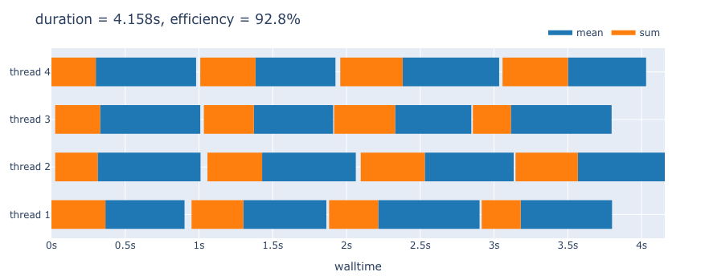

# ThreadGantt

This package provides a convenience macro to mark certain sections of code
and print out timestamps before and after execution, along with the thread number.
The output is then converted to a manually-drawn version of a Plotly Gantt chart.

The package is currently unregistered. Install it with
```julia
]add https://github.com/aminnj/ThreadGantt.jl
```

## Usage

Start julia with more than one thread to get anything useful out of this.
```bash
julia --threads 4
```
Then tag sections of code with the macro `@workunit` and labels (`"sum"` and `"mean"` in this example).
```julia
julia> using ThreadGantt

julia> function foo()
        a = randn(100)
        s = 0.0
        sleep(rand()*0.05)
        @workunit "sum" begin
            sleep(0.25 + rand()*0.2)
            s += sum(a)
        end
        @workunit "mean" begin
            sleep(0.5 + rand()*0.2)
            s += mean(a)
        end
        s
    end
```

Do some work in parallel with threads. By default, information is printed to stdout
in case you want to pipe a script to a text file. 
```julia
julia> Threads.@threads for i in 1:8 ; foo(); end
[sum] thread = 2, start = 1.630745245690166e9, stop = 1.630745245965308e9, duration = 0.27514195442199707
[sum] thread = 1, start = 1.630745245681062e9, stop = 1.630745246068402e9, duration = 0.38734006881713867
# ...
[mean] thread = 3, start = 1.630745247075008e9, stop = 1.630745247668403e9, duration = 0.5933949947357178
[mean] thread = 4, start = 1.630745247183934e9, stop = 1.630745247803387e9, duration = 0.619452953338623
```

This package re-exports `capture` from [IOCapture.jl](https://github.com/JuliaDocs/IOCapture.jl) to capture stdout.
```julia
julia> c = capture() do
           Threads.@threads for i in 1:8 ; foo(); end
       end;

julia> plotgantt(c.output)
```

